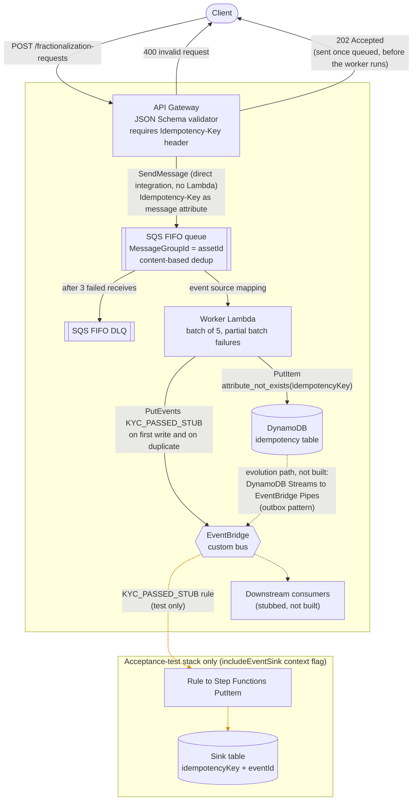

# Architecture

A walking skeleton of a tokenized-asset ledger: a client submits a fractionalization request, it is queued, recorded exactly once, and announced as a `KYC_PASSED_STUB` event. The two decisions that need explaining are recorded in [0001](decisions/0001-dedup-vs-idempotency.md) and [0002](decisions/0002-dual-write.md).

The outer box is the CDK `LedgerStack` (its title is left blank so the client edges don't cross it). Solid lines are built. Dotted grey lines are not built (downstream consumers, the outbox path). Dotted orange lines exist only in the acceptance-test stack (the sink).

## The boxes

**API Gateway.** A REST API with a JSON Schema model (`assetId` and `requestId`, required non-empty strings, from `@ledger/shared`) and a request validator that also requires the `Idempotency-Key` header. An invalid request gets a `400` and never reaches the queue. There is no Lambda in the hot path: the integration is a direct `SendMessage` to SQS through a Velocity template. `202` means "queued", not "processed"; an SQS failure maps to `500`, not `202`. The header is sent as a native SQS message attribute, because splicing it into the body via VTL fails with a parse error.

**SQS FIFO queue and DLQ.** `MessageGroupId` is the `assetId`, so requests for one asset are ordered and different assets run in parallel. Content-based deduplication is a cheap first filter and not the idempotency guard ([0001](decisions/0001-dedup-vs-idempotency.md)). A message that fails 3 receives moves to the FIFO DLQ.

**Worker Lambda.** Consumes batches of 5 with partial batch failure reporting. Records are handled in order, and once one fails, every later record in the same group is reported failed too, which is the FIFO rule for `reportBatchItemFailures`. The business rules live in `@ledger/domain` with no AWS imports; the worker only wires them to the SDK.

**DynamoDB idempotency table.** Keyed on `idempotencyKey`. `PutItem` with `attribute_not_exists(idempotencyKey)` is what guarantees a key is recorded once. The table is `DESTROY` on removal so an ephemeral stack redeploys cleanly, and the worker's role may do only that one `PutItem`.

**EventBridge custom bus.** The worker emits `KYC_PASSED_STUB` after the write, on a first write and on a duplicate ([0002](decisions/0002-dual-write.md)). Delivery is therefore at-least-once and consumers must be idempotent. Downstream consumers are stubbed, and the outbox pattern (DynamoDB Streams to EventBridge Pipes) is the documented path to remove the dual write.

**Acceptance-test sink (not production).** Deployed only with `-c includeEventSink=true`. A rule matches `KYC_PASSED_STUB` and starts a one-state Step Functions machine that writes each event to a table keyed by `idempotencyKey` and `eventId`, so specs can query by their own key and run in parallel. The production stack has neither the rule nor the table; a test asserts this.

## How it is tested

- `domain`: unit tests for the pure logic, red before green.
- `worker`: batch-handler tests with injected dependencies, including the FIFO group rule.
- `infra`: one whole-stack snapshot for each of the production and acceptance stacks, plus a few named invariants (the `DESTROY` policy, the required header, the acceptance stack providing every output the specs read).
- `acceptance-tests`: given/when/then specs against a fresh LocalStack deployment, run in CI, or against real AWS with `ACCEPTANCE_TARGET=aws`.
