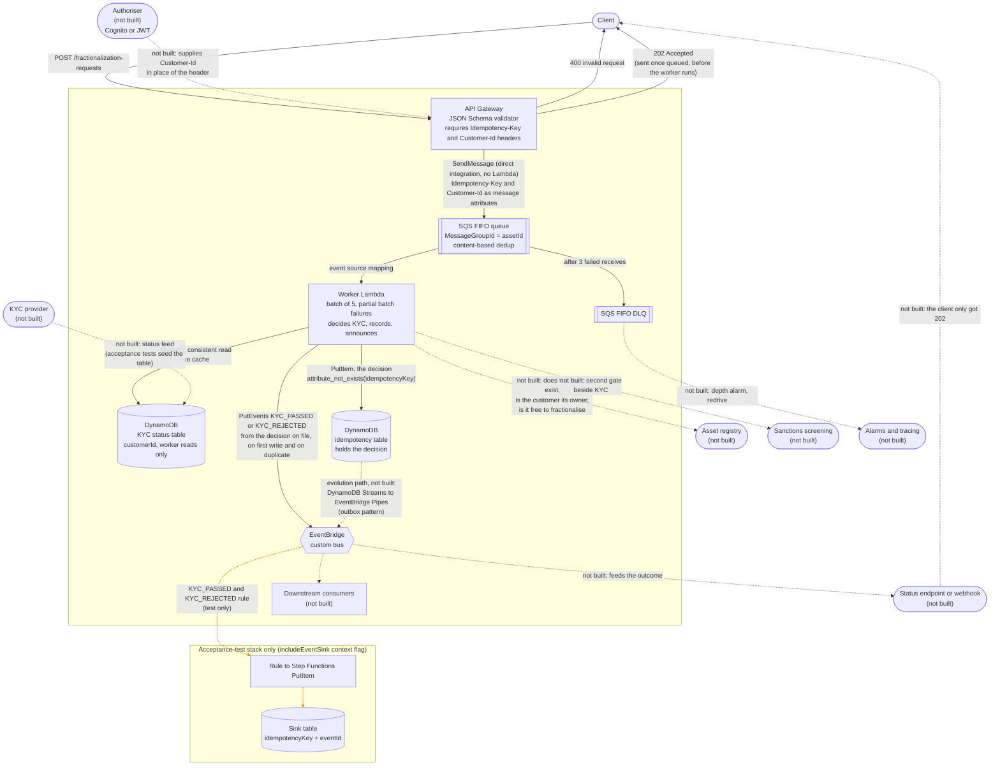

# Architecture

A walking skeleton of a tokenised-asset ledger: a client submits a fractionalisation request, it is queued, decided against the customer's KYC status, recorded exactly once with that decision, and announced as `KYC_PASSED` or `KYC_REJECTED`. The three decisions that need explaining are recorded in [0001](decisions/0001-dedup-vs-idempotency.md), [0002](decisions/0002-dual-write.md) and [0003](decisions/0003-kyc-gating.md).

The outer box is the CDK `LedgerStack` (its title is left blank so the client edges don't cross it). Solid lines are built. Dotted grey lines are not built (see below). Dotted orange lines exist only in the acceptance-test stack (the sink).

## Not built, on purpose

Each of these is a real part of a production system, drawn so the omission reads as a decision. None adds a new architectural idea beyond what is already built, so none is worth the code.

- **Downstream consumers and the outbox path.** The events are the contract; who listens is out of scope. The outbox is the documented fix for the dual write ([0002](decisions/0002-dual-write.md)).
- **KYC provider's status feed.** The acceptance tests seed the KYC table in its place ([0003](decisions/0003-kyc-gating.md)).
- **Authoriser.** Supplies the customer's identity. `Customer-Id` is the stand-in, and the request template is the one place that changes ([0003](decisions/0003-kyc-gating.md)).
- **Asset registry.** Would check that the asset exists, that the customer owns it and that it is free to fractionalise. It has the same shape as the KYC gate: a table, a pure rule, a recorded decision.
- **Sanctions screening.** A second external gate beside KYC, again the same shape.
- **Status endpoint or webhook.** The client only gets `202` ("queued"). Telling it the outcome is a consumer of the events.
- **Alarms and tracing.** A DLQ depth alarm and a redrive procedure, plus request tracing from the API to the event.

## The boxes

**API Gateway.** A REST API with a JSON Schema model (`assetId` and `requestId`, required non-empty strings, from `@ledger/shared`) and a request validator that also requires the `Idempotency-Key` and `Customer-Id` headers. An invalid request gets a `400` and never reaches the queue. `Customer-Id` stands in for the identity a real authoriser would supply; the request template is the one place that changes when real auth arrives, and a `customerId` in the body is never believed ([0003](decisions/0003-kyc-gating.md)). There is no Lambda in the hot path: the integration is a direct `SendMessage` to SQS through a Velocity template. `202` means "queued", not "processed", and it is the answer whatever the customer's KYC status turns out to be; an SQS failure maps to `500`, not `202`. Both headers are sent as native SQS message attributes, because splicing one into the body via VTL fails with a parse error.

**SQS FIFO queue and DLQ.** `MessageGroupId` is the `assetId`, so requests for one asset are ordered and different assets run in parallel. Content-based deduplication is a cheap first filter and not the idempotency guard ([0001](decisions/0001-dedup-vs-idempotency.md)). A message that fails 3 receives moves to the FIFO DLQ.

**Worker Lambda.** Consumes batches of 5 with partial batch failure reporting. Records are handled in order, and once one fails, every later record in the same group is reported failed too, which is the FIFO rule for `reportBatchItemFailures`. For each record it reads the key and customer from the message attributes, looks up the customer's KYC status, applies the decision rule, records the decision, and announces the decision that is on file. A rejection is a business outcome: the message is acknowledged, not retried into the DLQ. A failed lookup is a fault, so the message fails and is retried. The business rules live in `@ledger/domain` with no AWS imports; the worker only wires them to the SDK.

**DynamoDB KYC status table.** Keyed on `customerId`, holding the customer's status and when it expires. It is the ledger's own record of the outcome the KYC provider reached, never the documents behind it. The worker reads it with a strongly consistent `GetItem` on every request and keeps nothing in the Lambda, so a revocation counts on the next request; its role has `GetItem` and nothing else, so a bug cannot make a customer verified. Nothing in the stack fills it: the provider's feed is the unbuilt part, and the acceptance tests seed it.

**DynamoDB idempotency table.** Keyed on `idempotencyKey`. `PutItem` with `attribute_not_exists(idempotencyKey)` is what guarantees a key is recorded once, and the item holds the decision: customer, asset, outcome, reason, the KYC status it relied on, and when it was decided. When the key already exists the failed condition hands back the original item (`ReturnValuesOnConditionCheckFailure: ALL_OLD`), so a repeat replays the original decision and never re-decides it. The table is `DESTROY` on removal so an ephemeral stack redeploys cleanly, and the worker's role may do only that one `PutItem`.

**EventBridge custom bus.** The worker emits `KYC_PASSED` or `KYC_REJECTED` after the write, from the decision on file, on a first write and on a duplicate ([0002](decisions/0002-dual-write.md)). Delivery is therefore at-least-once and consumers must be idempotent. Both events carry `assetId`, `idempotencyKey` and `customerId`; a rejection also carries its reason. Downstream consumers are not built, and the outbox pattern (DynamoDB Streams to EventBridge Pipes) is the documented path to remove the dual write.

**Acceptance-test sink (not production).** Deployed only with `-c includeEventSink=true`. A rule matches both KYC events and starts a one-state Step Functions machine that writes each to a table keyed by `idempotencyKey` and `eventId`, storing its `detailType` and its whole `detail` as JSON, so specs can query by their own key and run in parallel. The production stack has neither the rule nor the table; a test asserts this.

## How it is tested

- `domain`: unit tests for the pure logic, red before green. `evaluateKyc` takes the clock as an argument, so expiry needs no waiting.
- `worker`: batch-handler tests with injected dependencies, told as a story: a verified customer, a customer who has not passed KYC (pending, expired, nothing on record), a key already decided (a rejection replayed for a customer verified since), a body that claims to be someone else, and the FIFO group rule.
- `infra`: one whole-stack snapshot for each of the production and acceptance stacks, plus a few named invariants (both tables `DESTROY`, both headers required, the sink matching both events, the acceptance stack providing every output the specs read).
- `acceptance-tests`: given/when/then specs against a fresh LocalStack deployment, run in CI, or against real AWS with `ACCEPTANCE_TARGET=aws`. They read back what was written, not only that something was: the decision on record, the status it relied on and when it was decided.
